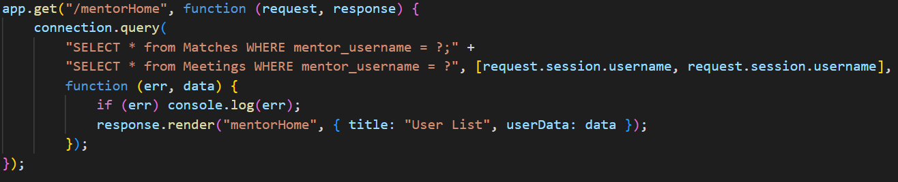
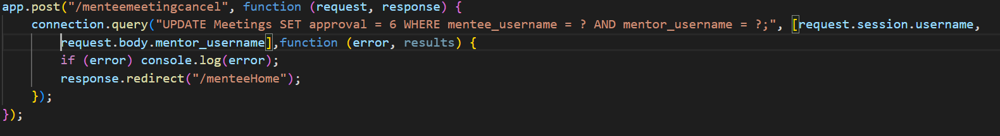
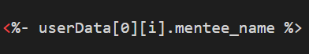

# Mentor Match

The Mentor Match web application is intended to provide an easy to use and direct pathway connecting soon-to-be graduates (mentees) of the University with Otago Alumni (mentors) in their field of interest. In this application, mentees and mentors can sign up and provide details on their professional background such as education and experiences. This information is then used to make a match between mentee and mentor, where a meeting can be scheduled. 

The motivation of this project is to provide a new and improved version of connecting mentees and mentors; to allow for increased efficiency and reliability in matching. The current build status of the application is that of deployment in the cloud. This application is hosted by Render and Heroku for the time being - at a free tier level due to cost constraints. The functionality so far has been working with no problem and encryption of details have been made as a precaution for security. However, there is no guarantee that it is up to a University level - which would require additional time and is currently outside our field of expertise. Comprehensive manual testing have been implemented to ensure appropriate error messages are shown for trouble-shooting. However, if the system crashes, please contact the contributors of this application.

The application uses Node.js (an open sourced back-end JavaScript runtime environment), enhanced JavaScript (ejs) and CSS for styling and an agile approach for development was used for incremental development. This application mainly uses get and post request when using Node.js. For example, a get request will query sql statements, which in turn returns  it into a row data packet array and we store it into a variable called userData. 

For post request, we get the input data the user has submitted and query it into the database, after which we can redirect to the same page as a refresh. 

We are then able to access the stored userData in the ejs with the use of <% %> as shown below.

This application allows users to easily sign up and log in to the system and is built with styling to stand out and attract users. 
- Mentees of the system can permanently save their details into the system, as well as add images of themselves to present to the mentors in their application. Mentees can also search by filter for mentors that have caught their attention and prompt for an application. After an application is made by the mentee, they will be notified in the home page; until further approved by both mentor and admin- affter which a confirmation and congratulatory notification is made to the mentee. After a mentee and mentor is matched, the mentee can fill out a form to book a meeting time with the mentor which will need to be confirmed. There is also the resources page where various external links such as zoom, teams and feedback forms are present to enhance the meeting experience.
- Mentors of the system can also save their details into the system and display an image of themselves to the mentees. Mentors will have a notifications panel in their home page where applications from mentees arrive - this can be accepted or decline, sending a notification to the mentee of the results. If accepted, the mentor must wait for approval from the admin before the match has been set. In the home page, the mentors can accept or decline the meeting time requested by the mentee.

- The admin of the system will be able to edit and delete mentee and mentor profiles. They also have to accept or decline matches brought forth from mentees and mentors as well as the authority to remove existing matches. The admin can edit the resource page if meeting applications such as zoom is outdated. A data page is also present in the navigation bar for the admin which provides a summary of matches between mentee and mentors.

Please download the latest release from the location (note that you will be required to have a GitBucket account on the University of Otago server):

- https://isgb.otago.ac.nz/info301/tahsa067/Team-3/archive/master.zip

---

### MacOS/Linux Instructions for set up
---

1. Navigate to https://nodejs.org/en/download/
2. Download and Install node.v16.17.1pkg **macOS Installer** or **Linux x64 Binaries**
3. Navigate to https://dev.mysql.com/downloads/workbench/
4. Download and Install **macOS (x86, 64-bit), DMG Archivem** or **Ubuntu Linux 22.04 (x86, 64-bit), DEB Package**
5. Open Settings and Start MySQL server
6. Open Settings: Assign name to **root** and Assign Password to **Password#**
7. Extract **Team-3-master.zip** 
8. Right click the extracted folder and open folder in terminal
9. Enter **npm intsall** and hit the enter key
10. Enter **npm start run** and hit the enter key
11. Navigate to [http://localhost:3000](http://localhost:3000)
12. You should now be able to login to the site with administrator privilege: username: admin and password: admin

---
### Windows Instructions for set up
---
1. Navigate to https://nodejs.org/en/download/
2. Download and Install node.v16.17.1 x86.msi **Windows Installer**
3. Navigate to https://dev.mysql.com/downloads/workbench/
4. Download and Install **Windows (x86, 64-bit), MSI Installer**
5. Enter run in the start search bar and open services.msc
6. Scroll down to find MySQL80, right click and start 
7. Open Settings: Assign name to **root** and Assign Password to **Password#**
8. Extract **Team-3-master.zip** 
9. Right click the extracted folder and open folder in terminal
10. Enter **npm intsall** and hit the enter key
11. Enter **npm start run** and hit the enter key (if error, enter node login.js instead)
12. Navigate to [http://localhost:3000](http://localhost:3000)
13. You should now be able to login to the site with administrator privilege: username: admin and password: admin

---
###  Deployment setup currently
---
   1. Contact Oliver for: the log-in details for Render which deploys the express application and ClearDB server for the database deployment.

---
### Admin Email details for Google forms (Please change the Password):
---
   1. First name: Admin
   2. Last name: Admin
   3. Username: OtagoMentorAM@gmail.com
   4. Password: thisisabadpassword

---
### Addition of Forms done by Admin:
---
   1. Login to admin account with username: **admin** and password: **admin**
   2. In the resources page for: **Mentor** Form add: https://docs.google.com/forms/d/e/1FAIpQLSe75D8haNWjmDThtu6BJgfu5yfDltC9EbJeoeJmFn1NnarMhw/viewform
   3. In the resources page for: **Mentee** Form add: https://docs.google.com/forms/d/e/1FAIpQLSfuBQyN55zctJcXROnDPnZgUSnobJXrTb0Z8B9pF1OLFODkWA/viewform?entry.839337160=Very+Satisfied&edit2=2_ABaOnufa2qDOjAJAwK9OwkTaADhhBsJw2W1VOiiqJXCUayDfPVTdcQUz_UFAdAg7aA  

---

Thanks for installing and we hope this improves your experience.

If you have any problems in regards to the setup instructions, please don’t hesitate to email Keiran at [kppatel789@gmail.com](mailto:kppatel789@gmail.com) or Oliver at [oliveroconnor4@gmail.com](mailto:oliveroconnor4@gmail.com) or Sara at [taha.s20001@gmail.com](mailto:taha.s20001@gmail.com) or Calvin at [Cpang2013@gmail.com](mailto:Cpang2013@gmail.com) or Dray at [drayambrose@gmail.com](mailto:drayambrose@gmail.com)

Credits to Oliver O'connor, Calvin Pang, Keiran Patel, Sara Taha and Dray Ambrose for their contribution to this project.
